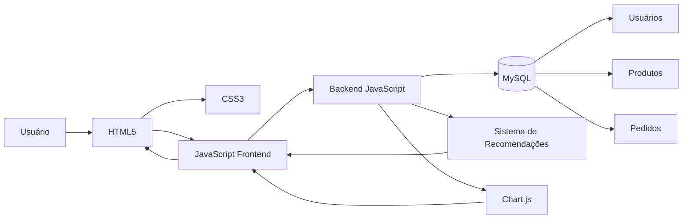

WalkWord
Sobre o Projeto

A WalkWord é uma plataforma de e-commerce voltada para a comercialização de roupas novas e seminovas, criada com o propósito de unir tecnologia, praticidade e sustentabilidade em uma única solução.

O projeto surgiu a partir da necessidade de incentivar práticas de consumo mais conscientes, oferecendo aos usuários uma alternativa segura para compra e venda de peças de vestuário. Além de ampliar o ciclo de vida dos produtos, a plataforma contribui para a redução do desperdício têxtil e promove os princípios da economia circular.

A proposta da WalkWord vai além da comercialização de roupas: busca proporcionar uma experiência digital moderna, intuitiva e eficiente, utilizando tecnologias atuais para garantir desempenho, organização e facilidade de uso.

Objetivos

O principal objetivo da WalkWord é desenvolver uma plataforma completa de comércio eletrônico que combine inovação tecnológica e responsabilidade ambiental.

Entre os objetivos específicos do projeto estão:

Incentivar a reutilização e a circulação de roupas novas e seminovas;
Facilitar o processo de compra e venda de produtos de vestuário;
Garantir segurança durante a navegação e as transações realizadas na plataforma;
Oferecer uma interface responsiva e acessível em diferentes dispositivos;
Utilizar dados para personalizar a experiência dos usuários;
Aplicar conceitos de desenvolvimento web, banco de dados e inteligência artificial em um ambiente real de negócio.
Funcionalidades
Gestão de Usuários
Cadastro de usuários;
Login e autenticação;
Gerenciamento de informações da conta.
Catálogo e Navegação
Exibição de produtos organizados por categorias;
Pesquisa por palavras-chave;
Filtros por tamanho, categoria e faixa de preço;
Visualização detalhada dos produtos.
Experiência de Compra
Lista de favoritos;
Carrinho de compras;
Processo de checkout;
Histórico de pedidos.
Personalização
Recomendações de produtos com base nas preferências dos usuários;
Análise de comportamento para sugestões mais relevantes.
Visualização de Dados
Geração de gráficos e indicadores para acompanhamento de informações relevantes da plataforma.
Tecnologias Utilizadas
Camada	Tecnologia
Frontend	HTML5
Estilização	CSS3
Interatividade	JavaScript (ES6+)
Alertas e Notificações	SweetAlert2
Visualização de Dados	Chart.js
Backend	JavaScript
Banco de Dados	MySQL
Arquitetura

A arquitetura da WalkWord foi estruturada em camadas, promovendo a separação de responsabilidades e facilitando a manutenção do sistema.

Usuário
   │
   ▼
Frontend
   │
   ▼
Backend
   │
   ├── Banco de Dados
   │
   └── Módulo de Recomendações
            │
            ▼
     Relatórios e Insights
Estrutura da Documentação

A documentação do projeto está organizada em módulos independentes para facilitar a compreensão da solução.

WalkWord
│
├── Sobre o Projeto
│
├── Frontend
│   ├── Interface
│   ├── Componentes
│   └── Experiência do Usuário
│
├── Backend
│   ├── Regras de Negócio
│   └── Processamento de Dados
│
├── Banco de Dados
│   ├── Modelagem
│   ├── Entidades
│   └── Relacionamentos
│
├── Inteligência Artificial
│   ├── Recomendações
│   ├── Personalização
│   └── Análise de Preferências
│
└── Engenharia de Software
    ├── Planejamento
    ├── Desenvolvimento
    ├── Testes
    └── Documentação
Sustentabilidade

A WalkWord foi concebida com foco na promoção de práticas sustentáveis dentro do setor da moda.

Ao incentivar a compra e venda de roupas novas e seminovas, a plataforma contribui para a redução do descarte prematuro de peças de vestuário, prolongando seu ciclo de vida e reduzindo impactos ambientais associados à produção e ao consumo excessivo.

Dessa forma, o projeto busca alinhar inovação tecnológica e responsabilidade socioambiental, demonstrando como soluções digitais podem gerar valor para usuários e para a sociedade.

Contexto Acadêmico

Este projeto foi desenvolvido para fins acadêmicos, aplicando conhecimentos adquiridos nas áreas de:

Desenvolvimento Web;
Banco de Dados;
Engenharia de Software;
Inteligência Artificial;
Arquitetura de Sistemas;
Experiência do Usuário (UX).
Equipe

Projeto desenvolvido como parte das atividades acadêmicas, com o objetivo de construir uma plataforma de e-commerce moderna, escalável e alinhada aos princípios de sustentabilidade e inovação.
## Arquitetura da WalkWord

